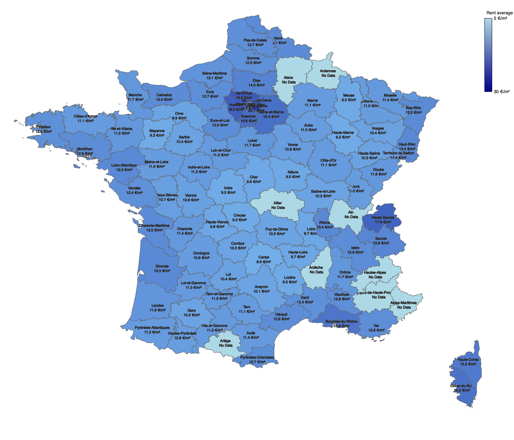

# Rental Affordability Visualization 🏠
[🇨🇳 中文 README](README.zh-CN.md) | [🇺🇸 English README](README.md)

Welcome! This is an interactive French rental affordability visualization project built using **p5.js**. It visualizes the median rental prices across various French departments by processing data from **departements.geojson** (the administrative boundaries of France) and corresponding rental statistics. In addition, the project now includes visualizations for the distribution of institutions (e.g., universities) and cycling stations across each region, allowing you to explore the relationship between universities and nearby cycling facilities in a detailed and interactive manner.

## Main Features ✨

1. **Interactive Map**
   - **Hover Effect**: When you hover over a department, the area will be **highlighted and zoomed in**, and a box plot (displaying statistical details such as Min, Q1, Median, Q3, Max, etc.) will appear in the top left corner.
   - **Gradient Legend**: A gradient legend in the top right of the map helps you quickly gauge the rental price levels across different regions.
   - **Pie Chart Visualization**: A new pie chart at the bottom of the map now displays the distribution of institutions (e.g., universities) per department.
   - **Detailed Department View**: Click on any department (for example, department 75) to enter a detailed view that shows both the distribution of universities and cycling stations in that region.
   - **User-Defined Distance Filter for Cycling Stations**:  
     - **Interactive Analysis**: Input your desired distance value to generate a table for further analysis.
     - **Color-Coded Map Markers**: The department map will update to highlight cycling stations in **green** if they fall within the specified distance and in **red** if they do not.
     - **Result Table**: Alongside the map, a table presents the top 30 cycling stations (sorted in ascending order) for closer inspection, while the map displays up to 100 cycling station markers (both green and red).

2. **Data Structure**
   - **departements.geojson**: Contains polygon/multipolygon data representing French department boundaries.
   - **departement_rental_data.json**: Stores rental statistics (minimum, quartiles, median, maximum, etc.) for each department.
   - **cycing_stations_departements.json**: Provides data on the number of cycling stations per department along with additional details such as capacity, free access, and surveillance.
   - **etablissement_departement.json**: Contains information about institutions (e.g., universities), including geographic coordinates (x, y), names, and types.
   - **etablissement_statistic.json**: Offers statistical data on the number of institutions per department, which is used to render the pie chart.

3. **Technical Details**
   - Utilizes **p5.js** and its `map()` function to convert geographic coordinates (latitude and longitude) to canvas coordinates.
   - Implements custom polygon collision detection (using `isPointInPolygon()` along with the ray-casting algorithm) for accurate mouse position detection over departments.
   - Leverages the `mouseMoved()` event to trigger real-time redraws, ensuring smooth hover and highlight effects.
   - **New Feature**: Incorporates distance-based filtering and analysis—users can specify a distance to see which cycling stations meet the criteria (highlighted in green) versus those that do not (highlighted in red), with results summarized in an accompanying table.

## File Structure 📁

```bash
.
├── data/
│   ├── department_distance/
│       ├── department_code_10.json
│       ├── department_code_13.json
│       ├── ...
│
│   ├── bike_station.png                  // Bike Station image used for the map visualization
│   ├── marker_map_bike_green.png         // Bike Station (matching conditions) image
│   ├── marker_map_bike_red.png           // Bike Station (not matching conditions) image
│   ├── private.png                       // Private Institutions image used for the map visualization
│   ├── public.png                        // Private Institutions image used for the map visualization
│   ├── cycling_stations_statistic.json   // Counts Public vs Private per department of cycling stations
│   ├── departements.geojson              // Geographic data for French department boundaries
│   ├── departement_rental_data.json      // Rental statistics data for each department
│   ├── cycing_stations_departements.json // Cycling station data and additional information
│   ├── etablissement_departement.json    // Institution (e.g., university) geographic data and details
│   └── etablissement_statistic.json      // Statistical data for institutions per department (for the pie chart)
├── sketch.js                             // Main p5.js code
├── index.html                            // Main webpage that includes p5.js & the script
└── README.md                             // Project overview and instructions
```

## Visual Demonstration 💶




## Future Plans 🚀

1. **Department-Level Zoom**
   - When clicking on a department, transition to a zoomed-in view for detailed inspection of rental and location distributions.
   - Add a “Return to National View” button for quick navigation back to the overall map.

2. **Enhanced Institution Display** 🏫
   - Load more detailed institution (university) data and display it as a **scatter plot** on the zoomed department map.
   - On hover, display additional information such as the institution’s name, specialties, and ranking.

3. **Additional Geographic Layers**
   - Integrate more detailed geographic data (e.g., municipality-level) to further enhance visualization and interaction.

4. **Visualization Enhancements**
   - Implement **animated or smooth zoom transitions** in the department view to improve user experience.
   - Introduce advanced filtering options (e.g., filtering by rental price range, institution type, etc.) to boost usability.

5. **Backend Data Updates**
   - In future versions, integrate backend data services via APIs to enable real-time updates of rental and institution information, ensuring that the displayed data remains current.


## How to Use 💡

1. **Clone the Project / Download the Code**
   
   ```bash
   git clone https://github.com/xxx/Rental_Affordability_Visualisation.git
   cd Rental_Affordability_Visualisation
   ```

2. **Launch a Local Server**
   While you can often run the p5.js project by simply opening `index.html` locally, it is highly recommended to use a local server:
   
   ```bash
   # For example, using VSCode with the Live Server extension on port 5500:
   # Then, access the project via http://localhost:5500 in your browser.
   ```

3. **Interact with the Visualization**
   - **Hover** over any department on the map to see the highlighting, zoom effect, and the rental statistics box plot.
   - **Examine** the gradient legend at the top right to understand the rental price ranges.
   - **Analyze Cycling Stations**: Enter a desired distance value in the distance filter tool. The map will update to highlight cycling stations in green if they are within that distance and in red if not. Additionally, a table will display the top 30 results (sorted in ascending order) for deeper analysis, while the map shows up to 100 cycling station markers.
   - **Review the Pie Chart**: At the bottom of the map, the pie chart displays the distribution of institutions (such as universities) per department.

> **Note**: Due to one of the data files being very large, the GitHub page cannot host it. Please use the provided personal server to access the complete dataset. We apologize for any inconvenience.

---

## Contributing 🤝

If you would like to contribute or have suggestions for improvements, please feel free to open a [Pull Request](https://github.com/) or an [Issue](https://github.com/). Your feedback is invaluable!

**Merci beaucoup!** Thank you for your interest and support. We hope this project helps you gain better insights into rental trends as well as the distribution of universities and cycling stations across France. Enjoy exploring!
